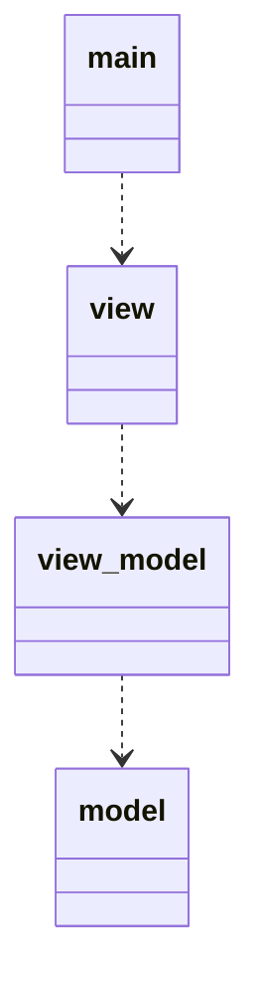

https://halzoblog.com/setstate-mvvm/

# 思ったこと
- modelの役割がview_modelに吸い取られていないか?
    > ドメイン領域を担います。ドメイン領域と言われると始めて聞いた方からすると意味不明です。
要はビジネスロジックやデータを格納するクラス（データクラスやエンティティ）、DAOなどの処理を担当する部分です。MVCで言うところののModelです。  
    by [いまさら人に聞けないMVVMの概要](https://qiita.com/naoi/items/05c2b1bba9b0fa4b0700)
    - DAO: Data Access Object. DBのCRUD操作を集約したような形．[参考](https://qiita.com/KyungJoon960/items/e0e926c56e67c709d612)
    - `countNumberO` は，modelが保持するべきな気がする．
        - この情報は，本来modelの向こう側のDBが保持する値であり，view_modelは値を保存しないから．
        - だけど，view側も表示用に一時的に値を保持しているんだよな…
        - でも，view_modelが値を保持する必要性は無いと思う．
        - getterにするのがいいんじゃね?
        - viewに対して，view_modelがデータを保持しているかのように見せかけることができる．
- 調べている中で，Riverpodを使うのが良いのではという気がしてきた．
  - 主に，[これ](https://zenn.dev/koji_1009/articles/f15ff24e20e36f)を読んで思った．
  - [doc](https://riverpod.dev)を読んでみたところ，そこまで難しい印象は受けなかっった．
  - 実際にやってみる．
  - やってみているけど，うまく更新できていない．もしかして[これ](https://zenn.dev/naoya_maeda/articles/a8bbf40a202c74#statenotifierprovider)で実装しないといけない?
  - できた．
